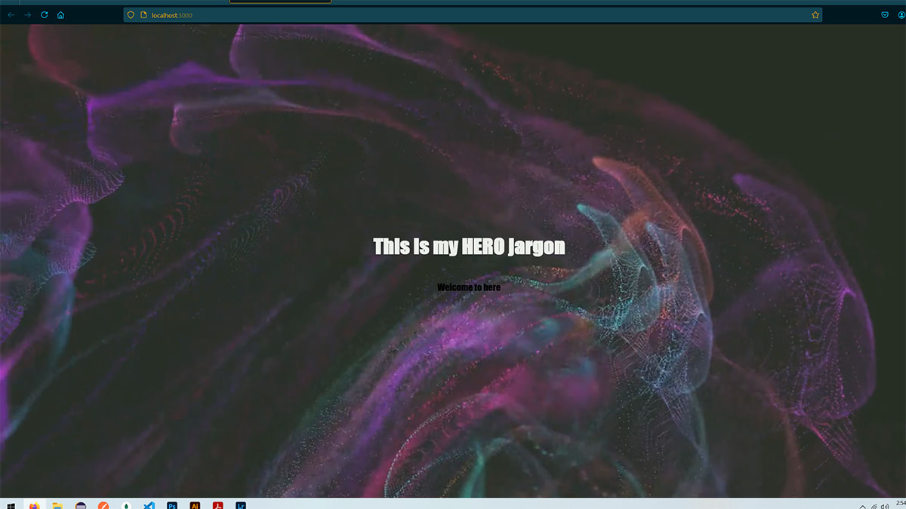

    
  
    
  

# Simple REACT Hero Component  

Github User: https://github.com/saibhreas   Email: fullstack@saibhreas.com

## Purpose

### This REPO is two part demonstration of my work.

This repo contains an app that is a basic demonstration of a REACT based web page

#### Part One:  *READme.md*  and additional **MD** files chronicle the progression through the my build of a simple REACT component.

This *READme.MD* is published as a demonstration of basic:

* Documentation standards
* Technical writing
* Understanding of technical concepts
* Example of writing style

*READme.md* files should be at the least: readable, concise, organized, and succinct.  They should have a style that reflects the purpose of the repository, the project, or the app it represent.  

  
Demonstrate grasp of software

* Reactjs
* Nodejs 
* HTML layout concepts

## Table of Content
  
[Description](#description)

[Build](#build)

[Usage](#usage)

[Technologies](#technologies)

[Links](#links)
  
  
## Description

The is an example of basic REACT component to be used for hero space in the GUI.  It is a self contained package complete with style sheet. 

Main.js is an exportable RECT component containing a video looped an muted running, with an overlay.  

Styling has it as full screen to run in the background as Hero page.

The development environment was **VS Code**

- may need to install extensions:

  * Prettier
  * ES7+ React/Redux/React-Native snippets
  * Console Ninja

## Build

  <!-- 1. [Start](/projectRead/DevSetUp.md) -->
-create Main branch folder

    git init

-create package.JSON

    npm init

-initialize the app

    npx create-react-app hero1-app
    
-cd to hero1-app

-the following notes should appear:

    To address all issues (including breaking changes), run:
    npm audit fix --force

    Run `npm audit` for details.

    Success! Created hero1-app at E:\Prog Environ\Basics\AppComponents\myHeros\hero1\hero1-app
    Inside that directory, you can run several commands:

    npm start
    Starts the development server.

    npm run build
    Bundles the app into static files for production.

    npm test
    Starts the test runner.

     npm run eject
    Removes this tool and copies build dependencies, configuration files
    and scripts into the app directory. If you do this, you can’t go back!

    We suggest that you begin by typing:

      cd hero1-app
      npm start

-*clean out unnecessary files*

-create app structure

  * inside src make the following folders:
    * components
    * assets - inside assets add a video folder
   
-inside component build the main.js file

  * use rfce to create an exportable component.

## Usage

Free to read and fork. 

## Technologies

* 

* 

* 

## Links

